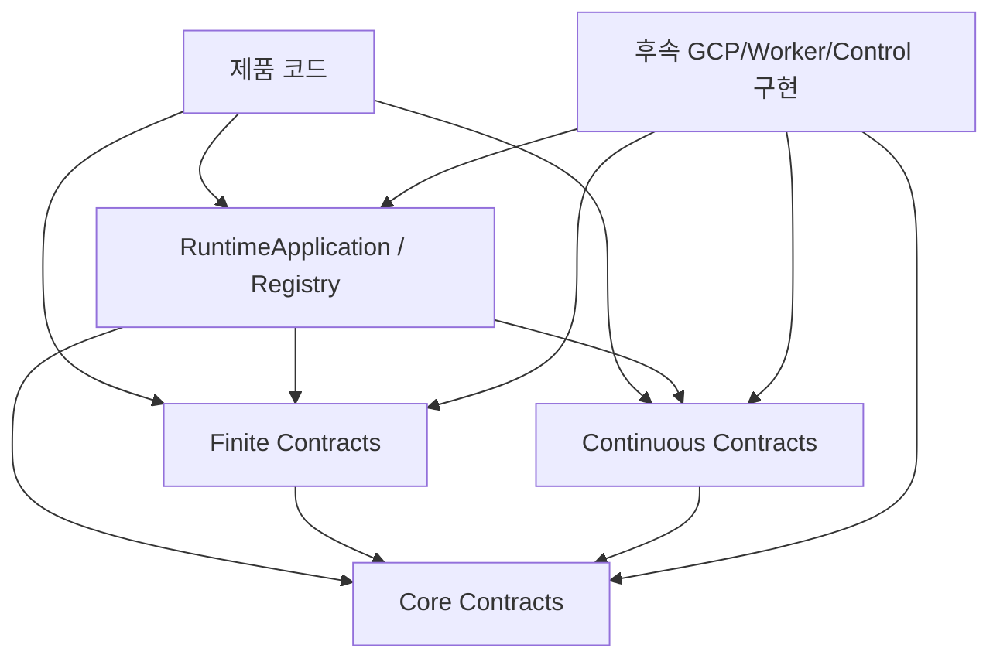

# 현재 계약 계층 아키텍처

## 목적

Milestone01은 GCP 서비스를 직접 사용하지 않는다. 이번 단계의 목적은 앞으로 만들
worker와 GCP 연결 코드가 따라야 할 공통 규칙을 먼저 정하는 것이다.

쉽게 말하면, **실제 실행 장치를 만들기 전에 플러그 모양과 연결 규칙부터 정한
단계**다.

이 분리는 다음 문제를 막는다.

- 주문, 문서 같은 제품 전용 데이터가 공통 runtime 코드에 섞이는 문제
- Pub/Sub 메시지와 Python 객체의 형식이 서로 다르게 이해되는 문제
- 같은 요청을 다시 계획했는데 실행 목록이나 ID가 달라지는 문제
- lease를 잃은 오래된 worker가 계속 데이터를 쓰는 문제
- 자동 확장된 worker가 DB 연결 한도를 넘는 문제
- 기본 기능만 쓰는 사람도 GCP package를 설치해야 하는 문제

## 현재 package 구조

```text
distributed_runtime
├── application.py          제품 코드가 처음 사용하는 진입점
├── registry.py             workload와 sink를 등록하고 찾는 곳
├── core/
│   ├── identifiers.py      형식을 검사하는 ID
│   ├── enums.py            실행 상태 목록
│   ├── errors.py           종류와 세부 정보를 담는 오류
│   ├── envelope.py         전송할 V1 메시지 형식
│   ├── artifacts.py        외부 저장 파일 참조
│   ├── config.py           설정과 DB 연결 수 계산
│   ├── lifecycle.py        시각, 마감, 중단, 종료
│   └── logging.py          작업별 로그 정보
├── finite/contracts.py     끝나는 작업을 나누고 처리하는 규칙
├── continuous/contracts.py 계속되는 작업의 구역과 소유권 규칙
├── gcp/                    앞으로 GCP 연결 코드를 둘 자리
├── worker/                 앞으로 실제 실행 코드를 둘 자리
├── control/                앞으로 제어 API를 둘 자리
└── testing/                앞으로 사용자용 테스트 도구를 둘 자리
```

코드는 아래 화살표 방향으로만 다른 영역을 사용한다.



`core`, `finite`, `continuous`는 GCP client를 불러오지 않는다. 그래서 계약 계층만
사용할 때는 Google package가 필요 없다.

## 현재 실행 가능한 것

- application과 registry 만들기
- workload와 sink를 등록하고 이름·버전이 맞는지 확인하기
- Finite planner의 전체 결과를 모아 이전 결과와 달라졌는지 확인하기
- Continuous partition 목록을 ID 순으로 정렬하고 중복을 막기
- 메시지, artifact 참조, 설정 객체의 입력값 확인하기
- 현재 Python process 안에서 마감, 중단, 안전한 종료 처리하기
- 검색하기 쉬운 key-value 로그 정보 만들기
- 공개 API와 메시지 형식이 실수로 바뀌지 않았는지 테스트하기

## 현재 실행할 수 없는 것

- run과 deployment를 DB에 저장하기
- 여러 worker 중 하나가 실행 시도를 가져가기
- Pub/Sub 메시지를 보내거나 처리 완료·실패 응답하기
- 실패한 작업의 재시도 시각을 정하거나 DLQ로 옮기기
- partition 처리 권한을 DB에서 얻고, 연장하고, 반납하기
- 권한을 잃은 worker의 DB 또는 sink 쓰기를 막기
- 작업량에 맞춰 VM 수를 자동으로 바꾸기
- Terraform으로 GCP 리소스를 만들기

예를 들어 `LeaseHandle.authorizes()`는 “이 소유권 정보가 서로 맞는가?”만 확인한다.
DB 쓰기까지 자동으로 보호하지는 않는다. 앞으로 만들 DB 코드는 owner와 fencing
token이 현재 값인지 저장 쿼리에서 다시 확인해야 한다.

## 핵심 불변식

### Domain neutrality

runtime은 application, workload, execution, partition처럼 여러 제품에서 함께 쓸 수
있는 말만 사용한다. 주문, 문서, 크롤링 대상 같은 제품 전용 데이터는 payload나 제품
DB에 둔다.

### Immutable boundaries

message, payload, configuration처럼 코드 사이를 오가는 데이터는 만든 뒤 바뀌지
않는다. 객체를 만든 다음 원래 dictionary를 수정해도 객체 안의 값은 그대로다.

다만 등록 내용을 추가하는 `RuntimeRegistry`, 중단 상태를 바꾸는
`CancellationSource`, 종료 상태를 관리하는 `GracefulShutdown`은 역할상 값이
바뀌어야 한다.

### Fail-closed validation

잘못된 실행 종류, 정수 자리에 들어온 `True`, 범위를 벗어난 비율, 문자열이 아닌 JSON
key, `NaN`/`Infinity`, 중복 ID를 임의로 고치지 않고 바로 거부한다.

### Deterministic identity

Finite 실행 ID는 run ID, 실행 코드 revision, unit key로 만든다. 이 세 값이 같으면
항상 같은 실행 ID가 나온다. planner payload는 key 순서를 정리한 JSON의 SHA-256으로
비교한다.

### Fenced continuous ownership

Continuous 작업은 deployment, partition, owner, fencing token이 모두 맞을 때만 현재
처리 권한이 있다고 본다.

### GCP-free import

기본 wheel과 `distributed_runtime.gcp` 이름 공간은 Google client package가 없어도
불러올 수 있어야 한다.

## 목표 아키텍처와의 관계

| 현재 계약 | 후속 구현 |
|---|---|
| `VersionedEnvelope` | Pub/Sub 메시지 변환·전송·수신 코드 |
| `ArtifactReference` | Cloud Storage 파일 저장·읽기 코드 |
| `RuntimeConfig` | 환경별 설정 파일과 Terraform 결과 연결 |
| `ExecutionUnit` | Cloud SQL 실행 행과 outbox 메시지 |
| `ExecutionContext` | Finite worker의 한 번 실행 시도 |
| `LeaseHandle` | Cloud SQL 소유권 확인 transaction |
| `EventSink` | 소유권을 확인한 결과 전송 adapter |
| `CancellationToken` | 종료 신호, lease 상실, 시간 초과 연결 |
| `LogContext` | Cloud Logging용 JSON 로그 |

전체 목표와 Phase 2~5 계획은 각각 `../first.md`와
`../implementation-plan.md`를 참고한다.
