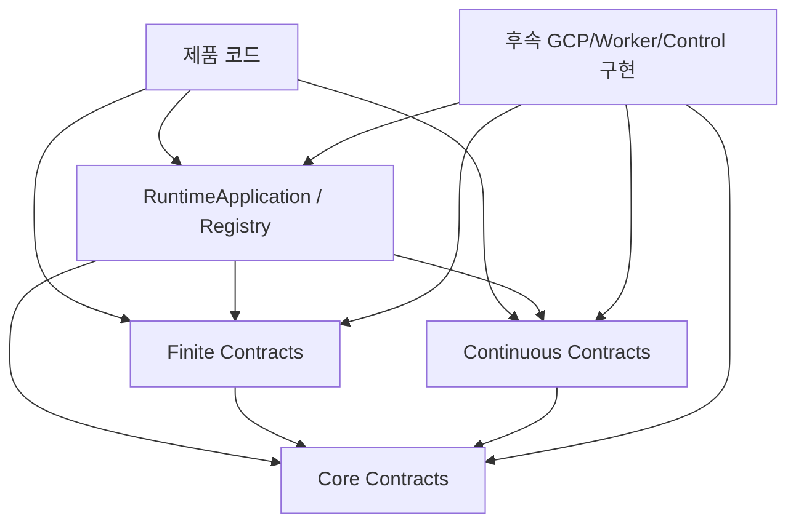

# 현재 계약 계층 아키텍처

## 목적

Milestone01은 GCP 서비스를 직접 호출하지 않는다. 대신 이후 실행 계층이 따라야 할
domain-neutral Python 계약을 확정한다.

이 분리는 다음 문제를 막는다.

- 제품 도메인 모델이 runtime package에 침투하는 문제
- Pub/Sub payload와 내부 객체가 암묵적으로 결합되는 문제
- 재시도할 때 planner 결과나 execution identity가 바뀌는 문제
- continuous partition의 오래된 owner가 쓰기를 계속하는 문제
- autoscaling 설정이 DB connection 한도를 초과하는 문제
- GCP SDK import가 core 사용자에게 강제로 전파되는 문제

## 현재 package 구조

```text
distributed_runtime
├── application.py          최소 product-facing facade
├── registry.py             workload/sink composition root
├── core/
│   ├── identifiers.py      강타입 ID
│   ├── enums.py            lifecycle 상태
│   ├── errors.py           구조화 오류
│   ├── envelope.py         canonical V1 message
│   ├── artifacts.py        immutable artifact reference
│   ├── config.py           typed config/capacity
│   ├── lifecycle.py        clock/deadline/cancellation/shutdown
│   └── logging.py          task-local structured log context
├── finite/contracts.py     planner/unit/handler/context
├── continuous/contracts.py partition/lease/sink/context
├── gcp/                    이후 GCP adapter namespace
├── worker/                 이후 worker namespace
├── control/                이후 control-plane namespace
└── testing/                이후 consumer test kit namespace
```

의존 방향은 다음과 같다.



`core`, `finite`, `continuous`는 GCP client를 import하지 않는다.

## 현재 실행 가능한 것

- application과 registry 생성
- workload/sink 등록과 identity 검증
- Finite plan materialization 및 deterministic drift 검증
- Continuous partition discovery 정렬과 중복 검증
- envelope/artifact/config 객체 생성과 boundary validation
- deadline/cancellation/shutdown의 process-local 동작
- structured log field 생성
- contract/API/compatibility 테스트 실행

## 현재 실행할 수 없는 것

- run/deployment을 durable DB에 생성
- execution attempt를 claim
- Pub/Sub 메시지를 publish/ack/nack
- retry를 예약하거나 DLQ로 이동
- partition lease를 DB에서 acquire/renew/release
- stale owner의 DB/sink 쓰기를 transaction으로 차단
- VM/MIG를 autoscale
- GCP 리소스를 provision

예를 들어 `LeaseHandle.authorizes()`는 fencing 조건을 표현하지만, DB transaction을
대신하지 않는다. 후속 repository 구현은 반드시 동일한 identity와 fencing token을
조건절에 포함해야 한다.

## 핵심 불변식

### Domain neutrality

runtime은 application, workload, execution, partition 같은 일반 용어만 사용한다.
제품의 주문, 문서, 크롤링 대상 같은 도메인 객체는 payload 또는 제품 저장소에 남는다.

### Immutable boundaries

message, payload, configuration 같은 데이터 boundary 객체는 frozen dataclass와
immutable mapping을 사용한다. 생성 뒤 입력 dictionary를 변경해도 내부 계약 값이
바뀌지 않아야 한다. composition root인 `RuntimeRegistry`와 process-local lifecycle
controller인 `CancellationSource`, `GracefulShutdown`은 의도적으로 mutable하다.

### Fail-closed validation

잘못된 mode, boolean integer, fraction, 비문자 JSON key, NaN/Infinity, 중복 identity를
암묵적으로 보정하지 않고 거부한다.

### Deterministic identity

Finite execution identity는 run, pinned execution revision, unit key에서 결정된다.
planner payload는 canonical JSON digest로 비교한다.

### Fenced continuous ownership

continuous 작업은 deployment, partition, owner, fencing token 전체가 일치할 때만
현재 소유권으로 간주한다.

### GCP-free import

기본 wheel과 `distributed_runtime.gcp` namespace는 Google client package가 없어도
import 가능해야 한다.

## 목표 아키텍처와의 관계

| 현재 계약 | 후속 구현 |
|---|---|
| `VersionedEnvelope` | Pub/Sub codec/publisher/subscriber |
| `ArtifactReference` | Cloud Storage artifact adapter |
| `RuntimeConfig` | 환경별 config loader와 Terraform output |
| `ExecutionUnit` | Cloud SQL execution row와 outbox |
| `ExecutionContext` | finite worker attempt runtime |
| `LeaseHandle` | Cloud SQL lease/fencing transaction |
| `EventSink` | runtime-fenced 또는 direct sink adapter |
| `CancellationToken` | SIGTERM, lease loss, timeout 연결 |
| `LogContext` | Cloud Logging JSON output |

전체 목표와 Phase 2~5 계획은 각각 `../first.md`와
`../implementation-plan.md`를 참고한다.
