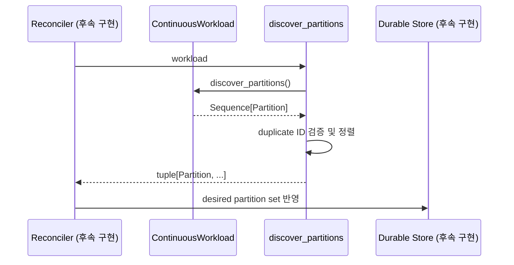

# Continuous workload

Continuous workload는 종료 시점이 정해지지 않은 입력을 partition 단위로 발견하고,
하나의 runtime instance가 유효한 lease를 보유하는 동안 처리하는 모델이다.

예:

- Kafka/Pub/Sub subscription shard 처리
- tenant별 지속 polling
- 데이터베이스 change stream
- 장시간 유지되는 외부 event feed

현재 구현은 partition, lease, fencing, sink의 **계약**을 제공한다. 실제 discovery
scheduler, Cloud SQL lease transaction, worker loop는 후속 단계다.

## 주요 타입

| 타입 | 책임 |
|---|---|
| `Partition` | 독립적으로 소유되는 immutable shard |
| `ContinuousWorkload` | discovery와 partition 처리 Protocol |
| `discover_partitions()` | 중복 제거가 아닌 중복 거부와 안정 정렬 |
| `LeaseHandle` | owner와 fencing token을 포함한 소유권 증명 |
| `PartitionContext` | handler에 제공되는 lease/sink/cancellation |
| `EventSink` | stable ID와 lease를 요구하는 출력 Protocol |
| `SinkGuarantee` | runtime-fenced와 reduced-direct 구분 |

## Discovery 흐름



`discover_partitions()` helper는 결과를 `PartitionId.value` 순으로 정렬한다. 같은
`PartitionId`가 두 번 나오면 payload가 같아도 실패한다.

## Partition 계약

`Partition`은 다음 값을 가진다.

- `partition_id`
- immutable JSON payload
- positive integer `weight`
- immutable string metadata

weight는 후속 balancing algorithm이 사용할 상대 비용이다. 현재 helper는 weight를
기반으로 배치하거나 instance에 할당하지 않는다.

partition ID는 discovery 순서나 worker instance에 의존하면 안 된다. 외부 shard나
tenant의 안정적인 identity를 사용한다.

## LeaseHandle

lease identity는 다음 네 값으로 구성된다.

```text
deployment_id
partition_id
owner_id
fencing_token
```

`LeaseHandle.authorizes()`는 네 값이 모두 정확히 일치할 때만 `True`다.

```python
lease.authorizes(
    deployment_id=current_deployment,
    partition_id=current_partition,
    owner_id=current_instance,
    fencing_token=token,
)
```

fencing token은 exact positive integer다. `1.0`, `True` 같은 Python 동등값은
허용하지 않는다.

## Fencing이 필요한 이유

다음 상황을 가정한다.

1. instance A가 token 10으로 partition을 처리한다.
2. heartbeat가 끊겨 lease가 만료된다.
3. instance B가 token 11로 partition을 인수한다.
4. 네트워크가 복구되어 A가 뒤늦게 쓰기를 시도한다.

owner 문자열만 비교하면 A의 stale write를 구분하기 어렵다. 저장소나 sink가 최신
token 11을 조건으로 요구하면 token 10인 쓰기를 거부할 수 있다.

현재 `LeaseHandle`은 조건을 표현하는 value object다. 실제 안전성은 후속 Cloud SQL
query와 sink adapter가 fencing token을 조건부 write에 포함해야 완성된다.

## PartitionContext

handler에 제공하는 값:

- workload ID
- 현재 partition
- 현재 lease
- sink registry
- immutable metadata
- cancellation token
- log context
- optional deadline

partition과 lease의 partition ID가 다르면 context 생성이 실패한다.

```python
await context.emit(
    "events",
    envelope,
    stable_id="partition:0/offset:184",
)
```

`emit()`은 sink name과 stable ID를 검증하고 현재 lease를 sink에 전달한다.

## Sink guarantee

### `RUNTIME_FENCED`

runtime이 관리하는 durable path를 통해 stable ID와 fencing token을 검증할 수 있는
sink를 의미한다.

예상되는 후속 구현:

- Cloud SQL outbox
- token 조건부 append
- stable ID unique constraint

### `REDUCED_DIRECT`

제품 코드가 외부 시스템으로 직접 전송하며 runtime이 fencing을 완전히 보장할 수 없는
경로다.

이 경우 문서와 운영 지표에 보장 축소를 명시해야 하고, 외부 시스템의 idempotency나
conditional write 기능을 제품이 책임져야 한다.

## ContinuousWorkload 계약

```python
class ContinuousWorkload(Protocol):
    name: str
    version: str
    mode: WorkloadMode

    async def discover_partitions(self) -> Sequence[Partition]: ...

    async def run_partition(
        self,
        context: PartitionContext,
        partition: Partition,
    ) -> None: ...
```

등록 name/version/mode는 workload 선언과 정확히 일치해야 한다.

## Cancellation과 lease loss

후속 worker는 최소한 다음 사건을 동일한 cooperative cancellation 경로로 연결해야 한다.

- SIGTERM
- deployment drain/stop
- lease renew 실패
- 더 높은 fencing token 발견
- handler deadline 만료
- process shutdown grace period 만료

handler는 `context.cancellation.raise_if_cancelled()`를 주기적으로 호출하거나,
I/O loop가 token 상태를 관찰하도록 구현한다.

## Reconciler의 후속 의무

- discovery 결과를 desired set으로 durable하게 기록한다.
- 사라진 partition은 즉시 삭제하지 않고 상태 전이를 관리한다.
- lease acquire 시 fencing token을 단조 증가시킨다.
- renew/release/checkpoint에 owner와 token 조건을 포함한다.
- 중복 reconcile tick을 안전하게 허용한다.
- expired lease를 회수하고 unassigned partition을 재배치한다.
- stale owner write와 duplicate event를 관측 가능한 metric으로 남긴다.
- shutdown 중 새 lease 획득을 멈추고 기존 partition을 drain한다.

## 현재 보장하지 않는 것

- cross-process lease exclusion
- external sink exactly-once
- partition 자동 balancing
- heartbeat 전송
- process 재시작 후 checkpoint 복원
- Cloud SQL failover 중 자동 재연결

이 보장은 `LeaseHandle`만으로 생기지 않으며, storage/worker/reconciler가 계약을
정확히 구현해야 한다.
