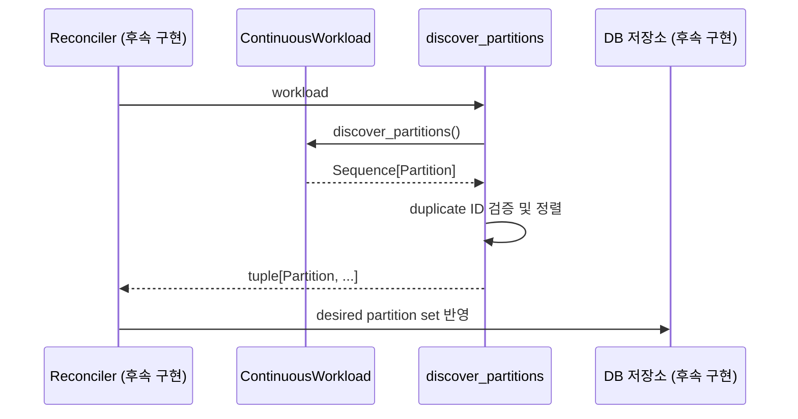

# Continuous workload: 계속 실행하는 작업

Continuous workload는 종료 시점이 정해지지 않은 작업이다. 처리 대상을 partition으로
나누고 여러 worker가 서로 다른 partition을 맡는다.

한 partition은 동시에 한 worker만 처리해야 한다. 이를 위해 worker는 일정 시간 동안
유효한 처리 권한인 lease를 얻는다.

예:

- Kafka 또는 Pub/Sub의 여러 구역 처리
- 고객별로 계속 반복하는 polling
- 데이터베이스 변경 내역 읽기
- 연결을 오래 유지하는 외부 이벤트 수신

현재 코드는 partition, lease, 오래된 worker 차단, 결과 전송에 대한 Python 규칙만
제공한다. partition을 주기적으로 찾는 작업, Cloud SQL 소유권 처리, 실제 worker
반복문은 아직 없다.

## 한눈에 보는 처리 순서

1. workload가 지금 처리해야 할 partition 목록을 반환한다.
2. reconciler가 목록을 DB의 원하는 상태와 맞춘다.
3. worker 하나가 partition의 lease를 얻는다.
4. worker가 lease를 가진 동안 `run_partition()`을 실행한다.
5. worker는 lease를 계속 연장한다.
6. lease를 잃거나 종료 요청을 받으면 처리를 멈춘다.

현재 구현은 1단계 결과 검사와 3~6단계가 따라야 할 데이터 규칙을 제공한다.

## 주요 타입

| 타입 | 쉬운 설명 |
|---|---|
| `Partition` | worker 하나가 맡아 처리할 독립 구역이다. |
| `ContinuousWorkload` | partition을 찾고 처리하는 제품 코드 규칙이다. |
| `discover_partitions()` | partition 목록을 정렬하고 중복 ID를 거부한다. |
| `LeaseHandle` | 누가 어떤 token으로 partition을 맡았는지 담는다. |
| `PartitionContext` | lease, sink, 중단 요청을 handler에 전달한다. |
| `EventSink` | 처리 결과를 내보내는 코드 규칙이다. |
| `SinkGuarantee` | runtime이 결과 전송을 어디까지 보호하는지 표시한다. |

## Partition을 찾는 흐름



`discover_partitions()` helper는 결과를 `PartitionId.value` 순으로 정렬한다. 같은
ID가 두 번 나오면 payload가 같아도 오류다. 중복 항목 중 하나를 조용히 버리지 않는다.

## Partition에 들어가는 값

`Partition`은 다음 값을 가진다.

- `partition_id`
- 만든 뒤 바뀌지 않는 JSON payload
- 1 이상의 정수 `weight`
- 만든 뒤 바뀌지 않는 문자열 metadata

`weight`는 partition 하나가 다른 partition보다 얼마나 무거운지를 나타내는 상대
값이다. 앞으로 balancing 코드를 만들 때 사용할 수 있다. 현재 helper는 weight를
검사만 하고 worker 배치에는 사용하지 않는다.

partition ID는 목록의 순서나 현재 worker 이름으로 만들면 안 된다. 같은 외부 shard나
고객은 다시 발견해도 같은 ID가 나와야 한다.

## 누가 partition을 맡았는지 나타내는 LeaseHandle

lease는 다음 네 값을 함께 비교해야 한다.

```text
deployment_id
partition_id
owner_id
fencing_token
```

`LeaseHandle.authorizes()`는 네 값이 모두 정확히 같을 때만 `True`를 반환한다.

```python
lease.authorizes(
    deployment_id=current_deployment,
    partition_id=current_partition,
    owner_id=current_instance,
    fencing_token=token,
)
```

fencing token은 1 이상의 정수여야 한다. Python에서 비슷하게 취급될 수 있는 `1.0`과
`True`는 받지 않는다.

## 오래된 worker의 쓰기를 막아야 하는 이유

다음 상황을 가정한다.

1. worker A가 token 10으로 partition을 처리한다.
2. A의 네트워크가 끊겨 lease가 만료된다.
3. worker B가 더 큰 token 11로 partition을 이어받는다.
4. A의 네트워크가 복구되고 A가 뒤늦게 결과를 쓰려고 한다.

4단계의 A는 이미 권한을 잃은 오래된 worker다. 저장소와 sink가 최신 token 11을
요구하면 token 10을 가진 A의 쓰기를 거부할 수 있다. 이 번호가 fencing token이다.

현재 `LeaseHandle`은 네 값이 맞는지 Python 안에서 비교할 뿐이다. 실제로 안전하려면
Cloud SQL 쿼리와 sink도 “token이 아직 최신인가?”를 쓰기 조건에 포함해야 한다.

## Handler가 받는 PartitionContext

handler는 `PartitionContext`에서 다음 값을 받는다.

- workload ID
- 현재 partition
- 현재 처리 권한
- 결과를 보낼 sink 목록
- 만든 뒤 바뀌지 않는 metadata
- 중단 요청
- 로그에 넣을 공통 정보
- 설정된 경우 작업을 끝내야 하는 시각

partition ID와 lease의 partition ID가 다르면 context를 만들 수 없다.

```python
await context.emit(
    "events",
    envelope,
    stable_id="partition:0/offset:184",
)
```

`emit()`은 sink 이름과 이벤트 ID가 올바른 형식인지 확인한다. 그리고 현재 lease를
sink에 함께 전달한다. sink는 이 lease로 아직 쓰기 권한이 있는지 확인할 수 있다.

## 결과 전송을 어디까지 보호하는가

### `RUNTIME_FENCED`

후속 sink가 runtime이 관리하는 DB 경로를 사용하고, 이벤트 ID와 fencing token을
확인하겠다는 표시다.

현재 구현에는 `SinkGuarantee` 값과 `EventSink` 규칙만 있다. 실제 DB 쓰기와 오래된
worker 차단 기능은 아직 없다. 아래 항목은 후속 구현이 이 보장을 제공하기 위해 필요한
예다.

- Cloud SQL outbox
- 최신 token일 때만 저장하는 조건부 쓰기
- 같은 이벤트 ID의 중복 저장을 막는 DB 제약

### `REDUCED_DIRECT`

제품 코드가 외부 시스템으로 바로 결과를 보낸다. runtime DB를 거치지 않으므로
runtime이 오래된 worker의 쓰기를 완전히 막을 수 없다.

이 방식을 사용하면 보호 수준이 낮다는 사실을 문서와 운영 지표에 표시해야 한다.
중복 방지나 token 확인은 제품 코드와 외부 시스템이 맡는다.

## 제품 코드가 구현할 메서드

```python
class ContinuousWorkload(Protocol):
    name: str
    version: str
    mode: WorkloadMode

    async def discover_partitions(self) -> Sequence[Partition]: ...

    async def run_partition(
        self,
        context: PartitionContext,
        partition: Partition,
    ) -> None: ...
```

registry에 등록한 이름, 버전, 실행 종류는 workload 클래스가 선언한 값과 정확히
같아야 한다.

## 종료 요청이나 lease 상실을 처리하는 방법

후속 worker는 아래 사건을 모두 같은 cancellation 신호로 바꿔 handler에 전달해야 한다.

- SIGTERM
- deployment의 안전한 정지 또는 강제 중단
- lease 연장 실패
- 더 높은 fencing token 발견
- handler의 실행 마감 시각 도달
- 안전한 종료를 위해 기다릴 수 있는 시간 초과

handler는 긴 반복문 안에서 `context.cancellation.raise_if_cancelled()`를 주기적으로
호출해야 한다. 또는 I/O 대기 코드가 cancellation 상태를 확인하도록 만든다.

## 앞으로 reconciler가 구현해야 할 것

- 발견한 partition 목록을 DB에 원하는 상태로 저장한다.
- 사라진 partition을 바로 삭제하지 않고 종료 상태를 거치게 한다.
- 새 worker가 lease를 얻을 때 fencing token을 반드시 증가시킨다.
- lease 연장·반납·진행 위치 저장 시 owner와 token을 함께 확인한다.
- 같은 조정 작업이 겹쳐 실행되어도 상태가 깨지지 않게 만든다.
- 만료된 lease를 회수하고 주인이 없는 partition을 다시 배치한다.
- 오래된 worker의 쓰기와 중복 이벤트 수를 지표로 남긴다.
- 종료 중에는 새 lease를 얻지 않고 맡고 있던 partition만 정리한다.

## 현재 코드만으로는 되지 않는 것

- 여러 process 사이에서 동시에 lease를 얻지 못하게 막는 것
- 외부 sink에 이벤트가 정확히 한 번만 기록되는 것
- partition을 worker에 자동으로 고르게 나누는 것
- worker가 살아 있다는 heartbeat 전송
- process 재시작 뒤 마지막 처리 위치 복구
- Cloud SQL 장애 전환 중 자동 재연결

이 기능은 `LeaseHandle` 객체 하나로 생기지 않는다. 앞으로 만들 DB 저장 코드, worker,
reconciler가 같은 소유권 규칙을 모두 지켜야 한다.
