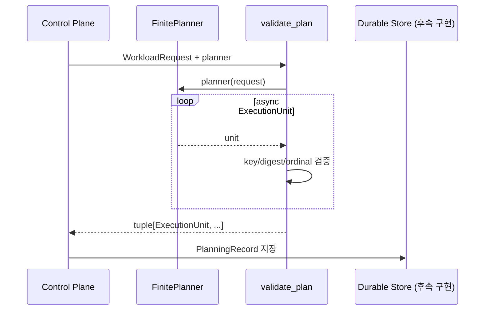

# Finite workload

Finite workload는 하나의 제출 요청을 0개 이상의 독립 실행 단위로 계획하고, 각 단위를
성공·실패·취소 중 하나의 종료 상태까지 처리하는 모델이다.

예:

- 파일 집합의 병렬 변환
- 테넌트별 배치 집계
- 일회성 데이터 import
- 제한된 URL 목록 처리

현재 구현은 planning과 handler의 **계약**을 제공한다. durable persistence, queue
dispatch, retry scheduler는 후속 실행 계층이 구현한다.

## 주요 타입

| 타입 | 책임 |
|---|---|
| `WorkloadRequest` | planner 입력과 두 revision을 고정 |
| `ExecutionUnit` | 독립적으로 재시도할 실행 단위 |
| `PlanningRecord` | durable drift 비교에 필요한 최소 정보 |
| `FinitePlanner` | async iterator로 unit을 생성하는 Protocol |
| `FiniteHandler` | 한 execution attempt를 처리하는 Protocol |
| `ExecutionContext` | handler가 받는 identity, attempt, cancellation |
| `validate_plan()` | plan materialization, 중복·drift·취소 검증 |

## Planning 흐름



planner 출력 개수는 0, 1, N 모두 유효하다.

## Revision 고정

`WorkloadRequest`에는 두 revision이 존재한다.

- `planner_revision`: 어떤 planning 코드를 사용했는지 나타낸다.
- `execution_revision`: 실제 handler 실행 코드의 revision을 나타낸다.

둘을 분리하는 이유는 planner를 변경하지 않고 handler만 배포하거나, 반대로 handler
revision을 유지한 채 planning 규칙만 변경할 수 있기 때문이다.

후속 control plane은 제출 시 두 revision을 확정하고 retry 동안 바꾸지 않아야 한다.

## Execution identity

`ExecutionUnit.execution_id(request)`는 다음 값을 NUL 문자로 결합한 뒤 SHA-256으로
해시한다.

```text
run_id + execution_revision + unit_key
```

결과 형식:

```text
execution:<64자리 sha256>
```

따라서 같은 run/revision/key는 항상 같은 ID가 되고, execution revision이 바뀌면
다른 ID가 된다.

`unit_key`는 planner 내부 위치가 아니라 workload 의미에 기반한 안정적인 값이어야 한다.
예를 들어 배열 index보다 `tenant:acme` 또는 `object:bucket/key`가 적합하다.

## Idempotency key

`ExecutionUnit.idempotency_key`를 생략하면 `unit_key`가 기본값이다.

이 값은 runtime 내부 중복 실행 억제를 위한 계약이다. 외부 결제, 이메일, 타사 API 같은
side effect가 exactly-once가 되는 것은 아니다. 제품 handler 또는 sink가 같은 key를
이용해 외부 시스템의 idempotency도 구현해야 한다.

## Canonical payload와 drift

unit payload는 생성 시 재귀적으로 immutable하게 변환된다. digest는 다음 canonical
JSON 규칙으로 계산한다.

- object key 정렬
- 공백 없는 separator
- UTF-8
- NaN/Infinity 금지
- 비문자 object key 금지

`PlanningRecord`는 다음 값만 저장한다.

```text
ordinal
unit_key
payload_sha256
```

retry planning 시 durable record를 `expected`로 넘기면 전체 tuple이 동일해야 한다.
다음은 모두 `PlanningDriftError`다.

- unit 순서 변경
- unit 추가 또는 삭제
- unit key 변경
- payload 변경
- 동일 key 중복

중복 key는 payload가 같더라도 허용하지 않는다.

## ExecutionUnit 검증

- `unit_key`, `handler`, `execution_class`: 안정적인 runtime name
- `timeout_seconds`: exact integer, 1~3600
- `max_attempts`: exact positive integer
- `idempotency_key`: 안정적인 runtime name
- `payload`: JSON-compatible immutable mapping

Python에서 `bool`은 `int`의 subclass지만 timeout과 attempts에서는 integer로
인정하지 않는다.

## Handler 계약

```python
async def handler(
    context: ExecutionContext,
    payload: Mapping[str, JsonValue],
) -> ExecutionResult:
    ...
```

`ExecutionResult`는 inline `JsonValue` 또는 `ArtifactReference`다.

`ExecutionContext`가 제공하는 값:

- run ID
- execution ID
- 1부터 시작하는 attempt
- idempotency key
- immutable string metadata
- cancellation token
- log context
- optional deadline

handler는 timeout이나 SIGTERM을 직접 추측하지 말고 cancellation/deadline 계약을
사용해야 한다.

## 실패 분류

후속 worker는 handler 오류를 최소한 다음과 같이 해석해야 한다.

| 오류 | 처리 방향 |
|---|---|
| `RetryableExecutionError` | runtime retry policy에 따라 재시도 |
| `RateLimitedExecutionError` | `retry_after`보다 이르지 않게 재시도 |
| `PermanentExecutionError` | 자동 재시도 없이 실패 |
| `CancelledExecutionError` | cancellation 상태로 종료 |
| 기타 예외 | adapter 정책에 따라 명시적으로 분류 |

현재 package는 retry를 예약하거나 attempt row를 갱신하지 않는다.

## 취소

`validate_plan()`에 cancellation token을 전달하면 다음 지점에서 확인한다.

1. planner 호출 전
2. 각 unit 수신 후
3. planner 종료 후

이를 통해 planner가 unit을 하나도 만들지 않거나 마지막 unit 직후 취소되는 경우도
일관되게 처리한다.

## 후속 실행 계층의 의무

- request와 revision을 durable하게 저장한다.
- planning record를 순서대로 저장한다.
- execution ID와 idempotency key에 unique constraint를 둔다.
- plan 저장과 dispatch를 transactional outbox로 연결한다.
- 완료 상태를 commit한 뒤 transport message를 ack한다.
- retry planning은 기존 record와 비교한다.
- handler timeout, SIGTERM, 사용자 취소를 `CancellationToken`에 연결한다.
