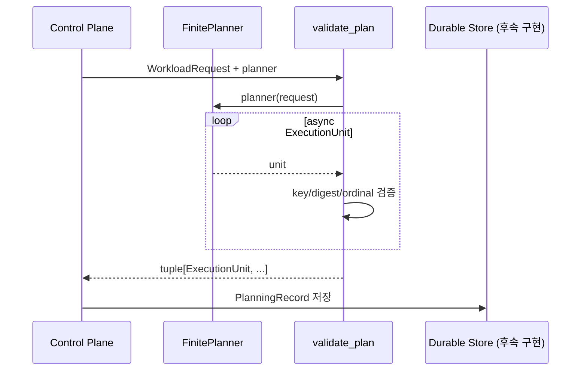

# Finite workload: 끝나는 작업

Finite workload는 처리할 양이 정해져 있고 결국 끝나는 작업이다.

큰 요청 하나를 바로 실행하지 않는다. 먼저 서로 독립적으로 처리할 수 있는 작은
`ExecutionUnit`으로 나눈다. 각 unit은 다른 unit과 따로 실행하고 재시도할 수 있다.

예를 들어 파일 1,000개를 변환한다면 파일 하나를 unit 하나로 만들 수 있다.

예:

- 파일 집합의 병렬 변환
- 고객별 일일 통계 계산
- 한 번만 수행하는 데이터 가져오기
- 제한된 URL 목록 처리

현재 코드는 “요청을 어떻게 나눌지”와 “unit 하나를 어떻게 처리할지”에 대한 Python
규칙을 제공한다. DB 저장, queue 전송, 실제 실행, 재시도 예약은 아직 구현하지 않았다.

## 한눈에 보는 처리 순서

1. 제품이 `WorkloadRequest`를 만든다.
2. planner가 요청을 `ExecutionUnit` 목록으로 나눈다.
3. `validate_plan()`이 중복과 이전 계획과의 차이를 검사한다.
4. 후속 control plane이 계획을 DB에 저장하고 queue로 보낸다.
5. 후속 worker가 handler를 호출한다.
6. 각 unit은 성공, 실패, 취소 중 하나로 끝난다.

현재 구현 범위는 1~3단계다.

## 주요 타입

| 타입 | 쉬운 설명 |
|---|---|
| `WorkloadRequest` | planner에 전달할 요청과 코드 버전을 고정한다. |
| `ExecutionUnit` | 따로 실행하고 재시도할 수 있는 작은 작업이다. |
| `PlanningRecord` | 이전 계획과 다시 만든 계획을 비교할 최소 정보다. |
| `FinitePlanner` | 요청을 받아 unit을 하나씩 만드는 코드 규칙이다. |
| `FiniteHandler` | unit 하나를 실제로 처리하는 코드 규칙이다. |
| `ExecutionContext` | 실행 ID, 시도 횟수, 중단 요청 등을 handler에 전달한다. |
| `validate_plan()` | planner 결과 전체를 읽고 중복·변경·중단을 확인한다. |

## 계획을 만드는 흐름



planner는 unit을 만들지 않아도 되고, 하나 또는 여러 개를 만들어도 된다. 예를 들어
조회 결과가 비어 있으면 unit 0개도 정상이다.

## Planner와 handler 버전을 따로 고정하는 이유

`WorkloadRequest`에는 두 revision이 존재한다.

- `planner_revision`: 어떤 planner 코드로 작업을 나눴는지 나타낸다.
- `execution_revision`: 어떤 handler 코드로 unit을 처리할지 나타낸다.

두 버전은 서로 따로 배포될 수 있다. 작업을 나누는 방법은 그대로 두고 handler만
고칠 수도 있고, handler는 그대로 두고 나누는 방법만 바꿀 수도 있다.

후속 control plane은 요청을 받을 때 두 revision을 확정해야 한다. 재시도 중에는
revision을 바꾸지 않는다. 그래야 같은 run이 중간에 다른 코드로 실행되지 않는다.

## 같은 unit에 항상 같은 실행 ID 만들기

`ExecutionUnit.execution_id(request)`는 다음 값을 NUL 문자로 결합한 뒤 SHA-256으로
계산한다.

```text
run_id + execution_revision + unit_key
```

결과 형식:

```text
execution:<64자리 sha256>
```

run ID, handler revision, unit key가 같으면 항상 같은 실행 ID가 나온다. handler
revision이 달라지면 새 실행으로 보므로 ID도 달라진다.

`unit_key`는 배열의 몇 번째인지보다 “무엇을 처리하는가”를 나타내는 값이 좋다.

- 피해야 할 예: `0`, `1`, `2`
- 권장 예: `tenant:acme`, `object:bucket/key`

입력 순서가 바뀌어도 같은 대상은 같은 key를 가져야 한다.

## 같은 작업이 다시 와도 안전하게 처리하기

`ExecutionUnit.idempotency_key`를 생략하면 `unit_key`가 기본값이다.

이 값은 runtime이 같은 논리 작업을 알아보는 기준이다. 하지만 이 값만 넣는다고 결제,
이메일, 외부 API 호출이 자동으로 한 번만 실행되는 것은 아니다.

제품 handler나 sink도 이 key를 외부 시스템에 저장하거나 전달해야 한다. 같은 key가
다시 들어왔을 때 이미 처리한 결과를 재사용하도록 제품 코드가 구현해야 한다.

## 다시 계획했을 때 결과가 달라지지 않았는지 확인하기

unit payload는 만든 뒤 바뀌지 않게 복사된다. 내용 비교에는 SHA-256을 사용한다.
dictionary key 순서처럼 의미 없는 차이 때문에 해시가 달라지지 않도록 JSON을 다음
규칙으로 정리한 뒤 계산한다.

- object key를 이름순으로 정렬
- 불필요한 공백 제거
- UTF-8
- NaN/Infinity 금지
- 문자열이 아닌 object key 금지

DB에는 payload 전체 대신 다음과 같은 작은 `PlanningRecord`를 저장할 수 있다.

```text
ordinal
unit_key
payload_sha256
```

같은 run을 다시 계획할 때는 이전 record를 `expected`로 넘긴다. 이전 계획과 아래
내용 중 하나라도 다르면 `PlanningDriftError`가 발생한다.

- unit 순서 변경
- unit 추가 또는 삭제
- unit key 변경
- payload 변경
- 동일 key 중복

같은 key가 두 번 나오면 payload가 완전히 같아도 오류다. 하나의 run 안에서 unit key는
반드시 하나만 있어야 한다.

## ExecutionUnit을 만들 때 확인하는 값

- `unit_key`, `handler`, `execution_class`: 비어 있지 않은 안전한 이름
- `timeout_seconds`: 1~3600 사이의 정수
- `max_attempts`: 1 이상의 정수
- `idempotency_key`: 비어 있지 않은 안전한 이름
- `payload`: JSON으로 표현할 수 있는 key-value 데이터

Python에서는 `True`가 정수 `1`과 비슷하게 동작하지만, 이 설정에서는 정수로
받아들이지 않는다. `timeout_seconds=True` 같은 실수를 바로 거부한다.

## Unit 하나를 처리하는 handler

```python
async def handler(
    context: ExecutionContext,
    payload: Mapping[str, JsonValue],
) -> ExecutionResult:
    ...
```

결과가 작으면 JSON 값을 바로 반환한다. 결과가 크면 Cloud Storage 같은 외부 저장소의
파일을 가리키는 `ArtifactReference`를 반환한다.

handler는 `ExecutionContext`에서 다음 값을 받는다.

- 전체 요청을 나타내는 run ID
- 현재 unit을 나타내는 execution ID
- 1부터 시작하는 실행 시도 번호
- 중복 처리를 막는 데 사용할 idempotency key
- 만든 뒤 바뀌지 않는 문자열 metadata
- 중단 요청을 확인할 cancellation token
- 로그에 공통으로 넣을 정보
- 설정된 경우 작업을 끝내야 하는 deadline

handler가 운영체제 종료 신호나 시간 초과를 각각 따로 해석하지 않는 것이 좋다. 후속
worker가 이런 사건을 cancellation과 deadline으로 바꿔 전달하고, handler는 그
공통 신호만 확인한다.

## 실패 종류에 따라 다음 행동 정하기

후속 worker는 handler가 낸 오류 종류를 보고 다음 행동을 정해야 한다.

| 오류 | 처리 방향 |
|---|---|
| `RetryableExecutionError` | 설정된 재시도 규칙에 따라 다시 실행 |
| `RateLimitedExecutionError` | `retry_after`가 지난 뒤 다시 실행 |
| `PermanentExecutionError` | 자동 재시도 없이 실패 |
| `CancelledExecutionError` | 취소 상태로 끝냄 |
| 기타 예외 | worker 정책으로 재시도 가능 여부를 명확히 결정 |

현재 package에는 오류 클래스만 있다. 다음 실행 시각을 정하거나 DB의 attempt 상태를
바꾸는 코드는 아직 없다.

## 계획을 만드는 중에도 중단할 수 있게 하기

`validate_plan()`에 cancellation token을 전달하면 다음 지점에서 확인한다.

1. planner 호출 전
2. 각 unit 수신 후
3. planner 종료 후

이 세 곳에서 확인하면 unit이 0개인 경우와 마지막 unit을 만든 직후 중단 요청이 온
경우도 놓치지 않는다.

## 앞으로 worker와 control plane이 구현해야 할 것

- 요청과 두 revision을 DB에 저장하고 재시도 중 바꾸지 않는다.
- planning record를 planner가 만든 순서대로 저장한다.
- execution ID와 idempotency key가 중복 저장되지 않게 DB 제약을 둔다.
- 계획 저장과 queue 발행 요청을 같은 DB transaction에 기록한다.
- 성공 상태를 DB에 저장한 다음에만 queue 메시지에 ack한다.
- 다시 계획할 때 이전 planning record와 비교한다.
- 시간 초과, 종료 신호, 사용자 취소를 `CancellationToken` 하나로 전달한다.
