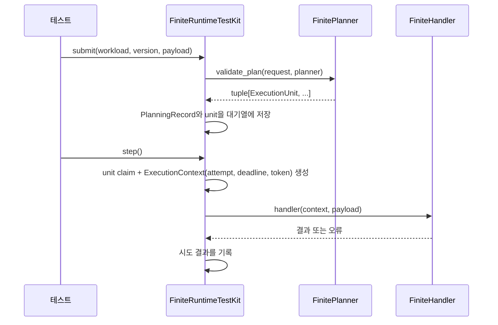

# 로컬 테스트 킷 설계

> 이 문서는 아직 구현되지 않은 `distributed_runtime.testing` package의 설계
> 계약이다. 구현은 [구현 세부 계획](../implementation-plan.md)의 #10~11이다.
> 이 문서의 코드 예시는 목표 API이며 구현 시 달라질 수 있다.
>
> **문서 상태:** 설계 초안
> **대상:** 제품 개발자(kit 사용자)와 runtime 구현자

## 목적

제품 개발자가 GCP, Pub/Sub, Cloud SQL 없이 자신의 코드를 검사할 수 있어야 한다.

쉽게 말하면, **runtime이 실제로 갖춰지기 전에 제품 코드가 계약대로 동작하는지
로컬에서 먼저 확인하는 도구**다.

kit으로 확인할 수 있는 것:

- planner가 같은 요청에 항상 같은 unit을 만드는지
- handler가 오류를 올바른 종류로 분류하는지
- cancellation token을 주기적으로 확인하는지
- continuous handler가 `PartitionContext.emit()`을 올바르게 사용하는지
- lease를 잃은 뒤에도 쓰기를 시도하는 실수가 없는지

## kit이 검증하지 않는 것

로컬 킷은 한 process 안에서 결정적으로 실행된다. 아래 항목은 킷이 통과해도
보장되지 않으며, 이후 PostgreSQL/integration/실제 GCP 단계에서 검증한다.

- 실제 DB transaction과 중복 저장 제약
- Pub/Sub의 중복 전달과 재전달 타이밍
- 여러 process 또는 VM이 동시에 같은 작업을 가져가는 경합
- 외부 API를 포함한 exactly-once
- 실제 시계에 따른 lease 만료와 heartbeat 간격

`ExecutionContext`와 `PartitionContext`는 현재 secrets, metrics, artifact
client를 제공하지 않는다. `first.md`의 context 예시는 목표 API다. 따라서
fake secret/metric provider는 context 계약이 생긴 뒤에 추가한다. 마찬가지로
checkpoint 저장 계약이 없으므로 킷은 emission 기록만 관찰한다.

## 설계 원칙

1. **기존 계약만 재사용한다.** 킷 전용 검증 타입이나 완화된 계약을 새로 만들지
   않는다. 잘못된 입력은 실제 runtime과 같은 곳에서 거부된다.
2. **시간은 항상 명시적으로 진행한다.** `core.lifecycle.FakeClock`을
   사용하며, 킷이 시간을 스스로 흐르게 하지 않는다. 테스트가 `advance()`로
   시각을 움직인다.
3. **실행도 명시적 step이다.** 메시지 전달, 재시도, lease 갱신은 각각 한 번의
   호출로 진행한다. 백그라운드 thread나 자동 loop를 두지 않는다.
4. **모든 결과를 기록한다.** 시도, 오류, emission을 테스트가 읽을 수 있는
   기록으로 남긴다. assert 대상은 제품 코드가 아니라 이 기록이다.
5. **외부 의존성이 없다.** 킷은 표준 library만 사용한다. `testing` extra는
   이미 선언되어 있으며 비어 있는 상태를 유지한다.

## Finite 킷

`implementation-plan.md` #10, Gate `IT-LOCAL-FIN`에 해당한다.

### 구성 요소

| 이름 | 역할 |
|---|---|
| `FiniteRuntimeTestKit` | registry에 등록된 planner와 handler를 로컬에서 실행하는 진입점 |
| `InMemoryUnitQueue` | 계획된 unit을 보관하고 전달·재전달을 시뮬레이션하는 대기열 |
| `RecordingAttemptStore` | 시도별 claim, 결과, 오류를 기록하는 저장소 |
| `FakeClock` | 이미 `core.lifecycle`에 존재. deadline과 재시도 시각 계산에 사용 |

### 실행 흐름



### 목표 API 예시

```python
kit = FiniteRuntimeTestKit(registry=app.registry)

kit.submit(
    workload="catalog.snapshot",
    version="1.0.0",
    payload={"product_ids": ["A", "B"]},
)

kit.step()          # 대기 중인 unit 하나를 한 번 실행
kit.run_pending()   # 실행 가능한 unit이 없을 때까지 반복
kit.clock.advance(10)

for attempt in kit.attempts():
    print(attempt.execution_id, attempt.status, attempt.error)
```

### 오류 분류 시뮬레이션

handler가 낸 오류에 따라 `ExecutionStatus` 값으로 기록한다.

| handler 결과 | 기록되는 상태 | 이후 동작 |
|---|---|---|
| 정상 반환 | `SUCCEEDED` | 완료 |
| `RetryableExecutionError` | `RETRY_SCHEDULED` | `FinitePolicy`의 base/cap으로 다음 시각 계산, clock이 지나면 재실행 가능 |
| `RateLimitedExecutionError` | `RETRY_SCHEDULED` | `retry_after` 이전에는 재실행하지 않음 |
| `PermanentExecutionError` | `FAILED` | 재시도 없음 |
| `CancelledExecutionError` / cancellation | `CANCELLED` | 중단으로 종료 |
| `max_attempts` 초과 | `DEAD_LETTERED` | 최종 실패 |

### 시뮬레이션할 수 있는 상황

- 같은 unit 메시지를 두 번 전달 — handler가 `idempotency_key`로 중복을
  처리하는지 확인한다. 킷은 중복 호출을 기록할 뿐 방지하지 않는다. 중복 방지는
  제품 handler 책임이다.
- `kit.cancel()`로 run 전체에 중단 신호 전달 — handler가 token을 확인하는지
  확인한다.
- 재계획 시뮬레이션 — 저장한 `PlanningRecord`를 `expected`로 넘겨
  `PlanningDriftError`가 발생하는지 확인한다.
- 실행 중간 취소 — unit의 child `CancellationSource`만 취소해 부분 중단을
  재현한다.

## Continuous 킷

`implementation-plan.md` #11, Gate `IT-LOCAL-CON`에 해당한다.

### 구성 요소

| 이름 | 역할 |
|---|---|
| `ContinuousRuntimeTestKit` | 등록된 continuous workload를 로컬에서 실행하는 진입점 |
| `FakeLeaseManager` | fencing token을 증가시키며 lease를 발급·연장·회수하는 관리자 |
| `RecordingSink` | `EventSink` 계약을 지키는 기록용 sink |
| `FakeClock` | lease 만료와 heartbeat 간격 계산에 사용 |

### Lease 규칙

`FakeLeaseManager`는 `ContinuousPolicy`의 시간 규칙을 FakeClock 기준으로
적용한다.

- lease를 새로 발급할 때마다 fencing token이 1씩 증가한다.
- `LeaseHandle.authorizes()`에 맡길 값(deployment, partition, owner, token)이
  모두 현재 값과 일치해야 연장과 쓰기가 받아들여진다.
- `lease_seconds`가 지나면 lease가 만료되고 다른 owner가 인수할 수 있다.
- 인수하면 새 owner에게 더 큰 token이 부여된다. 이전 owner의 `LeaseHandle`은
  더 이상 유효하지 않다.

### RecordingSink 규칙

- `guarantee`는 `SinkGuarantee.RUNTIME_FENCED`다.
- 같은 `stable_id`의 event는 한 번만 기록한다. fencing token이 바뀌어도
  `stable_id`가 같으면 같은 논리 결과로 모인다.
- 이미 인수된 partition의 오래된 token으로 `emit()`하면 거부한다. 이 거부가
  오래된 owner의 쓰기를 막는 장치를 시뮬레이션한다.

### 목표 API 예시

```python
kit = ContinuousRuntimeTestKit(registry=app.registry)

kit.deploy(workload="market.stream", version="1.0.0")
kit.reconcile()                     # discover_partitions 호출과 배정
kit.run_for(seconds=30)             # clock 진행 + handler step 실행
kit.expire_lease("partition-0")     # heartbeat 중단 상황 재현
kit.reconcile()                     # 다른 owner가 인수, token 증가

for emission in kit.emissions("partition-0"):
    print(emission.stable_id, emission.event)
```

### 시뮬레이션할 수 있는 상황

- owner 응답 중단: `expire_lease()`로 heartbeat가 멈춘 상황을 만들고
  `takeover_seconds` 이후 다른 owner가 인수하는지 확인한다.
- 오래된 owner의 쓰기: 인수 뒤 이전 `LeaseHandle`로 `emit()`을 시도해
  `RecordingSink`가 거부하는지 확인한다.
- partition 재배치: partition을 추가하거나 제거한 뒤 `reconcile()`이 배정을
  어떻게 바꾸는지 확인한다.
- drain: 배정 해제 신호가 handler의 cancellation token으로 전달되는지
  확인한다.

## 확정해야 할 세부 사항

구현 전에 정해야 하는 열린 항목이다.

- 재시도 대기 시간의 무작위 범위를 킷에서 어떻게 다룰지. 결정적 테스트를
  위해 계산된 대기 시각만 적용하고 무작위 요소는 생략하는 쪽이 기본안이다.
- 킷이 발급하는 `RunId`, `DeploymentId`, `RuntimeInstanceId`의 접두어.
  기존 identifier 계약 형식을 지키는 범위에서 `local-` 같은 구분자를
  사용할지 정한다.
- `run_for()`가 시간을 진행하는 단위. heartbeat 간격(기본 15초)보다 작은
  step으로 나눠 진행해야 연장 시점을 재현할 수 있다.

## 완료 기준

- `IT-LOCAL-FIN`: 계획 → 실행 → 재시도 → dead-letter, 중복 전달, 중단 시나리오
- `IT-LOCAL-CON`: 배정 → 실행 → emission → lease 만료 → 인수 → 오래된 token
  거부 시나리오
- 공개 API 기준 파일에 `testing_exports` 추가 — 공개 이름이 늘어나는
  변경이므로 [호환성과 버전 정책](../development/compatibility-and-versioning.md)의
  snapshot 리뷰 절차를 따른다.
- 문서: [문서 시작점](../README.md)의 현재 상태와
  [테스트와 품질 게이트](../development/testing-and-quality.md)의 테스트 표를
  함께 갱신한다.
